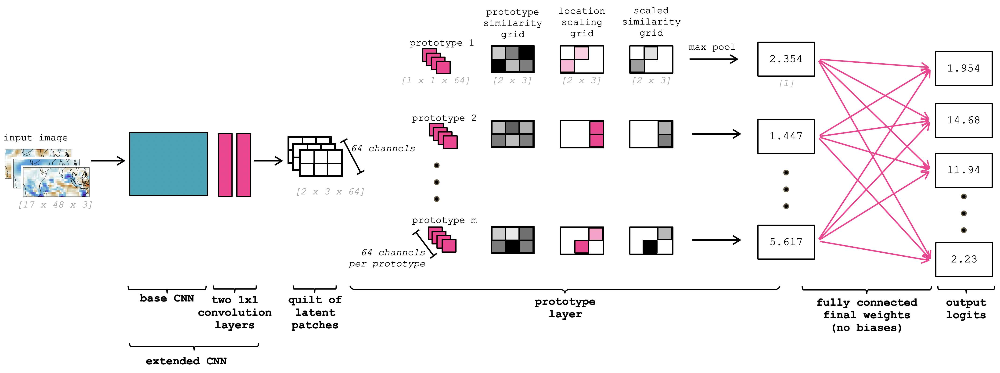
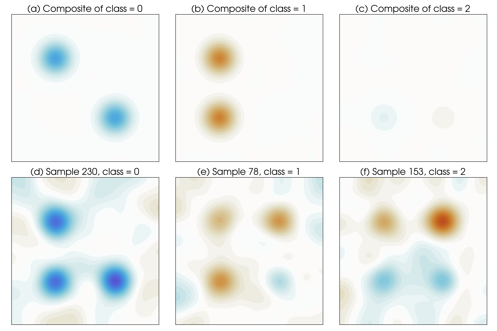
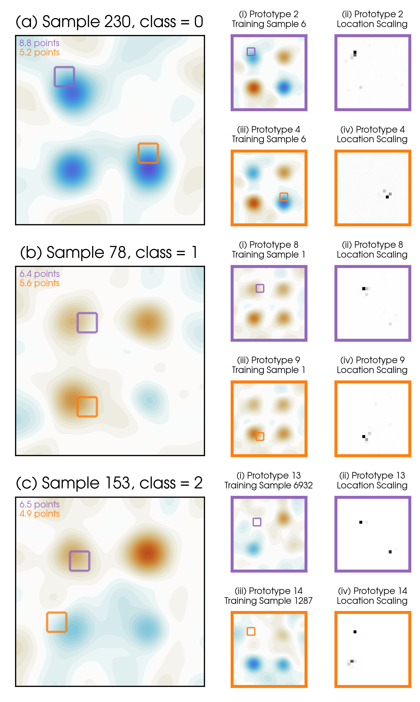

# *This* Looks Like *That There*
***
An interpretable neural network (ProtoLNet) based on training prototypes is extended from that developed by Chen et al. (2019) to consider absolute location. The network's decision making process is interpreted via looking at which patches of the input image look like specific prototypes (i.e. *this looks like that there*). The interpretability of the prototype architecture is demonstrated via applications to 2-dimensional geophysical fields.


## Tensorflow Code
***
This code was written in python 3.9.4 with tensorflow 2.5.0 and numpy 1.20.1. 

Within the ProtoLNet code:
* ```experiment_settings.py``` specificies the experiment parameters throughout the code
* ```_pretrain_CNN.ipynb``` pre-trains the base CNN if desired
* ```_main_CNN.ipynb``` trains the ProtoLNet
* ```_vizPrototypes.ipynb``` computes the prototypes and displays them

The ProtoLNet follows the architecture of the ProtoPNet of Chen et al. (2019) except with the addition of a location scaling grid within the prototype layer (see architecture schematic below).
<figure>
    
    <figcaption>Figure 1: Schematic depicting the ProtoLNet architecture. Example and internally consistent dimensions of the tensors at each step are given in grey brackets, although the specific dimensions vary for each use case. Pink colors denote components of the network that are trained (learned), while gray and black colors denote components that are directly computed. The weights within the base CNN (blue shading) can either be trained or frozen.</figcaption>
</figure>  


## Example use case
<figure>
    
    <figcaption>Figure 2: Class composites and example samples for the idealized quadrants use case. (a-c)Composites of all samples by class label, and (d-f) one example sample for each class.</figcaption>
</figure>  


<figure>
    
    <figcaption>Figure 3: Three example predictions by the network for the idealized quadrants use case, along with the two winning prototypes for each sample and the associated location scaling grid.</figcaption>
</figure>  


## General Notes
***

### Python Environment
The following python environment was used to implement this code.
```
- conda create --name env-tf2.5-cartopy
- conda activate env-tf2.5-cartopy
- conda install anaconda
- pip install tensorflow==2.5 silence-tensorflow memory_profiler  
- conda install -c conda-forge cartopy
- pip uninstall shapely
- pip install --no-binary :all: shapely
- conda install -c conda-forge matplotlib cmocean xarray netCDF4 
- conda install -c conda-forge cmasher cmocean icecream palettable seaborn
- pip install keras-tuner --upgrade
```

### Credits
This work is a collaborative effort between [Dr. Elizabeth A. Barnes](https://sites.google.com/rams.colostate.edu/barnesresearchgroup/home) and [Dr. Randal J. Barnes](https://cse.umn.edu/cege/randal-j-barnes). In addition, [Dr. Zane Martin](https://www.zanekmartin.com/) and [Jamin Rader](https://jaminrader.wordpress.com) contributed to the two use cases and the writing of the scientific article. The ProtoPNet of Chen et al. (2019) is the backbone of this work.

#### Funding sources
This work was funded, in part, by the NSF AI Institute for Research on Trustworthy AI in Weather, Climate, and Coastal Oceanography ([AI2ES](https://www.ai2es.org/)).

### References for the *"This Looks Like That There"* ProtoLNet
* ADD PREPRINT HERE

### Fundamental references for this work
* Chen, Chaofan, Oscar Li, Daniel Tao, Alina Barnett, Cynthia Rudin, and Jonathan K. Su. 2019. “This Looks Like That: Deep Learning for Interpretable Image Recognition.” In Advances in Neural Information Processing Systems, edited by H. Wallach, H. Larochelle, A. Beygelzimer, F. Alché-Buc, E. Fox, and R. Garnett. Vol. 32. Curran Associates, Inc. https://proceedings.neurips.cc/paper/2019/file/adf7ee2dcf142b0e11888e72b43fcb75-Paper.pdf

### License
This project is licensed under an MIT license.

MIT © [Elizabeth A. Barnes](https://github.com/eabarnes1010)


